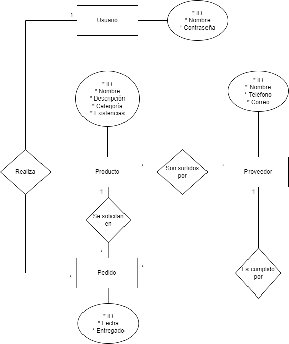
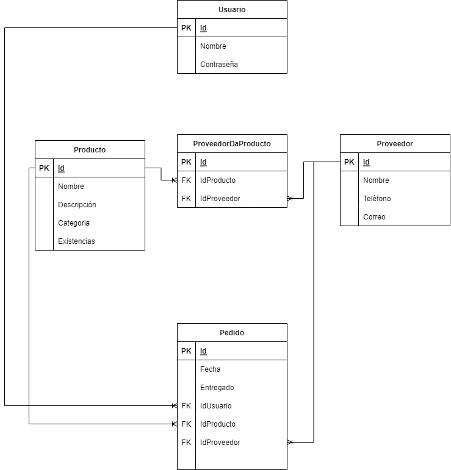
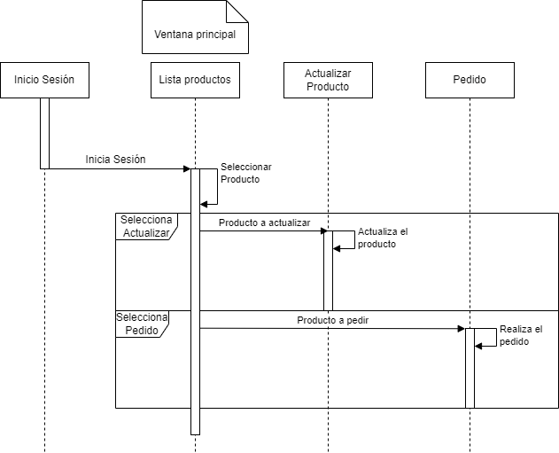

Atributos mas importantes
=========================

Inicio de sesión
----------------

En el mero inicio el se le solicitara al empleado que inicie sesión. Para esto
se le pedirá:

* ID
* Contraseña

Lista de productos
------------------

Luego de iniciar sesión en una ventana nueva se mostraran los productos
actuales disponibles. Se mostrara:

* ID
* Nombre
* Descripción
* Categoría
* Existencias en inventario

Tienen que haber 2 botones:

1. Actualizar la información de un producto
2. Colocar solicitud de pedido

Actualizar producto
-------------------

En una nueva ventana se mostraran tantas cajas de texto como atributos hayan en
los productos, con sus respectivas etiquetas para identificarlas. Todas las
cajas de texto tendrán que ser editables a excepción de la caja de texto con el
ID.

Habrán 2 botones, uno para guardar y otro para descartar los cambios.

Pedidos
-------

Para el producto seleccionado en una nueva ventana se mostraran:

* Caja de texto con el ID, no editable
* Caja de texto con el nombre del producto, no editable
* Lista que contendrá los posibles proveedores.
* Caja de texto editable que recibirá la cantidad deseada
* Un botón para confirmar el pedido

Base de datos
=============

Modelo Entidad-Relación
-----------------------

El análisis de las relaciones entre las entidades nos lleva al siguiente
diagrama:

Diseño de la Base de datos
--------------------------

El convertir el diagrama ER en tablas nos da como resultado:

Diagrama de secuencias
======================

